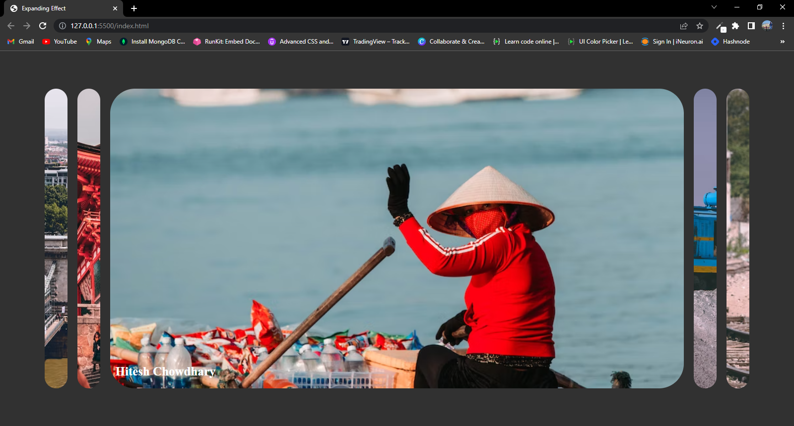

# 
# Expanding Effect 
### This Project has sections which can be expand on single click on them.
# Learning 
### 1. Injecting a specific active class on click to expand the section. 2. Removing all active classes before injecting on particular section so that only single section can have effect.

# Credit 
### This Project idea is not mine.it has been taken from brad traversery udemy course. but i learned from it that matters most for me.

